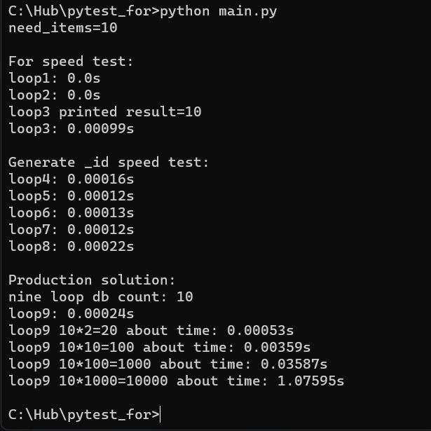

# Speed while generating id from uuid4x4

### Description:
A simple script for checking speed and making predictions for large numbers of IDs out of 4 UUID4s.  
There are several loops in the file, the first three are just a speed test of the standard for loop.
from 4 to 8 - test cycles, in which I tested different generation methods to choose the fastest and most correct solution for me.

# How to run:
## Use terminal or cmd to run this project.
```bash
$ git clone https://github.com/denver-code/for_test_python
$ cd for_test_python
$ python -m venv .venv
Linux:
$ source .venv/bin/activate
Windows:
$ .venv\scripts\activate.bat
$ python main.py
```

## Execution example: 



# Checking  
## Checking forecasts with a real figure:

We will use for the projected forecast - the picture above, there is all the approximate time, which is built from a different number of necessary IDs.
## Step 1
In the first line, we see the value of the need_items variable, this is 10. an example of the ID I need is:
```cmd
8e6ca7e8-bc09-4f1f-9313-c2fc10aee4d-231903b8-191f-4fe4-b6b9-27b76aab7a93-87e4d3b1-d3b1-4feb-a9c9-eff58b407 -45b3-8a6e-6caeffde97db
```
Its length is 147 characters, among them - 128 characters (letters and numbers). That is, 36 possible options for 1 position, there are 128 such positions.  
We recall the 11th grade of the school, or rather, combinatorics and constellations, we make the equation 128 ^ 36, and we get a lot of options for IDs.  
With a large number of ids already ready, there may be problems with generation, but this can be fixed by calling the generator function again (the execution time will increase noticeably.) approximately 7.
```python
237005577332262213973186563043e+75
```
or

```python
94.672220753319050022924562134291
```  
I don’t know how much it is exactly, but it’s a lot if the number of 128 character IDs is only from numbers - this is:
```python
1180591620717411303424(128^10)
```
possible combinations, then there are even more).  
The upper bound of int32 is 2,147,483,647.  
What is noticeably more than our number of combinations, bigint, int64 or other data structures can fix it.  
## Step 2
Now you can observe the real execution time of each value from the screenshot, I repeat, it is approximate there.

### Need items = 10
Execution time:
```python
#loop9: 0.00024s
```
Approximate time from example: `0.00024s`

### Need items = 20
Execution time:
```python
#loop9: 0.00062s
```
Approximate time from example: `0.00053s`

### Need items = 100
Execution time:
```python
#loop9: 0.00331s
```
Approximate time from example: `0.00359s`

### Need items = 1000
Execution time:
```python
#loop9: 0.03314s
```
Approximate time from example: `0.03587s`


### Need items = 10000
Execution time:
```python
#loop9: 1.20738s
```
Approximate time from example: `1.07595s`

## Checking conclusion  

On each computer, the result may be different, it depends on the characteristics.  

Usually, even on the same computer, you have to repeat the same process several times to get the (rounded up, it will never be the same) answer as the last time.  
Because of this, it is impossible to predict the exact execution time for the following values ​​from the approximate statistics.  
so when running the speed test on 10, it will take us `0.00024` seconds, but this time changes with each run, due to rounding, we can achieve a repetition of "exactly" (`0.0024`), but if we do not round, the result is different.  
So from the statistics we can take for the number 20 - in the example it is `0.00053`, in the real test of the number 20 it is `0.00062`, that is, the difference is small, but it is present.  
Predicting accurately - I didn't succeed, because I selected the coefficients based on the analysis of past launches of a certain number of IDs. It is different for each Hx increase.  
However, we have an approximate time, we can imagine how long it will take to generate 1000 IDs.  
At 10,000, we have a slightly larger deviation, due to the large number of IDs, compared to the small number of the original 10 IDs.  
### The higher the number, the more difficult it is to predict even the approximate time. Only by analysis and selection of the coefficient.

# Loops source code
need_items = 10
## loop1
Basic loop iterating current position.
```python
def loop1() -> int:
    result = 0
    for num in range(need_items):
        result += num
    return result
```

## loop2
Basic loop iterating only one.
```python
def loop2() -> int:
    result = 0
    for num in range(need_items):
        result += 1
    return result
```

## loop3
Basic loop with iteration of one, and output to the console (time slows down noticeably)
```python
def loop3() -> int:
    result = 0
    for num in range(need_items):
        result += 1
        print(f"loop3 printed {result=}", end='\r')
    print(end="\n")
    return result
```

## loop4
the first code of the generator, which has a nested function for creating an ID, in which a list is formed, and uuid4 is filled 4 times from the for loop.
```python
def loop4() -> int:

    db = []

    def generate_id():
        _uuid_list = []

        for i in range(1, 5):
            _uuid_list.append(str(uuid4()))

        _id = "-".join(_uuid_list)

        if _id not in db:
            return _id
        return generate_id()

    for num in range(need_items):
        db.append(generate_id())

    return len(db)
```

## loop5
Everything is the same as in the 4th loop, but instead of a loop - 4 lines of adding uuid4.
```python
def loop5() -> int:

    db = []

    def generate_id():
        _uuid_list = []

        _uuid_list.append(str(uuid4()))
        _uuid_list.append(str(uuid4()))
        _uuid_list.append(str(uuid4()))
        _uuid_list.append(str(uuid4()))

        _id = "-".join(_uuid_list)

        if _id not in db:
            return _id
        return generate_id()

    for num in range(need_items):
        db.append(generate_id())

    return len(db)
```

## loop6
Everything is the same as in the 5th loop, but instead of adding lines, and for loop - elements are added directly from the list during initialization.
```python
def loop6() -> int:

    db = []

    def generate_id():
        _uuid_list = [
            str(uuid4()),
            str(uuid4()),
            str(uuid4()),
            str(uuid4())
        ]

        _id = "-".join(_uuid_list)

        if _id not in db:
            return _id
        return generate_id()

    for num in range(need_items):
        db.append(generate_id())

    return len(db)
```

## loop7
We get rid of the built-in generation function, this reduces the time very noticeably. We also remove the initialization of the list in a separate anonymous variable. And add a list with an attachment of IDs.  
And also remove the check of whether the element is in the list.
```python
def loop7() -> int:
    db = []

    for num in range(need_items):
        _id = "-".join([
            str(uuid4()),
            str(uuid4()),
            str(uuid4()),
            str(uuid4())
        ])

        db.append(_id)

    return len(db)
```

## loop8
Exactly identical to option 7 - but already fixing, and designed to check the time with 7 and 8 loops.  
In the example for 7 it is `0.00012` and for 8 it is `0.00022` seconds, the difference is almost 2 times, and here we can understand why it is impossible to accurately predict, calculate what time will be for a larger number of elements, even if we have the same number of elements different results, with a difference of 2 times, the deviation is very large.
```python
def loop8() -> int:
    db = []

    for num in range(need_items):
        _id = "-".join([
            str(uuid4()),
            str(uuid4()),
            str(uuid4()),
            str(uuid4())
        ])

        db.append(_id)

    return len(db)
```

## loop9 - The final version on which statistics are generated.
Difference from 7 and 8 loop - added check if there is already an id in the list, and added a print to see if there will be a repeated element during generation.  
On small counts, it is unlikely that there will be matches, and the result will be like nid_items.  
But on large numbers, repetitions are already possible during generation, and we will be able to find out how many there were.
```python
def loop9() -> int:
    db = []

    for num in range(need_items):
        _id = "-".join([
            str(uuid4()),
            str(uuid4()),
            str(uuid4()),
            str(uuid4())
        ])

        if _id not in db:
            db.append(_id)
        else:
            continue
    print(f"nine loop db count: {len(db)}")
    return len(db)
```
# Generate analysis and selection of the coefficient.
I use a multiplication factor a little more than 2, 10, 100, 1000 - due to the fact that it did not give the correct result.  
I end up using:  
rounding to 5 decimal places.  
to increase by 2 times - coefficient 2.2  
to 10 times - 15.  
to 100 - 150.  
so that in 1000 - 4500.  
As a result, it works approximately correctly. But it can work worse for large numbers.  
```python
def loop9() -> int:
    db = []

    for num in range(need_items):
        _id = "-".join([
            str(uuid4()),
            str(uuid4()),
            str(uuid4()),
            str(uuid4())
        ])

        if _id not in db:
            db.append(_id)
        else:
            continue
    print(f"nine loop db count: {len(db)}")
    return len(db)

loop9_time = timeit.timeit(loop9, number=1)
print(f"loop9: {round(loop9_time, 5)}s")
print(
    f"loop9 {need_items}*2={need_items*2} about time: {round(loop9_time*2.2, 5)}s")
print(
    f"loop9 {need_items}*10={need_items*10} about time: {round(loop9_time*15, 5)}s")
print(
    f"loop9 {need_items}*100={need_items*100} about time: {round(loop9_time*150, 5)}s")
print(f"loop9 {need_items}*1000={need_items*1000} about time: {round(loop9_time*4500, 5)}s")
```
